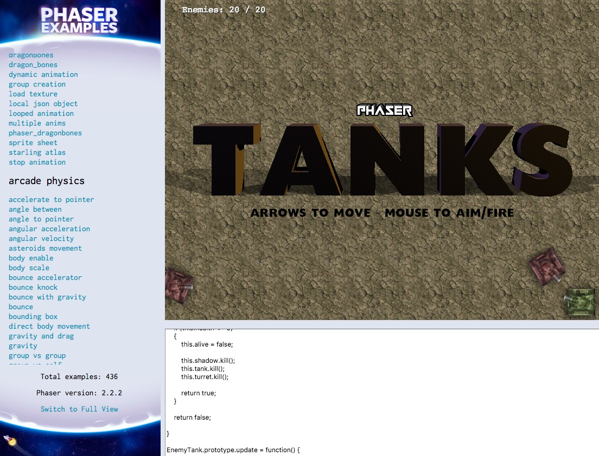
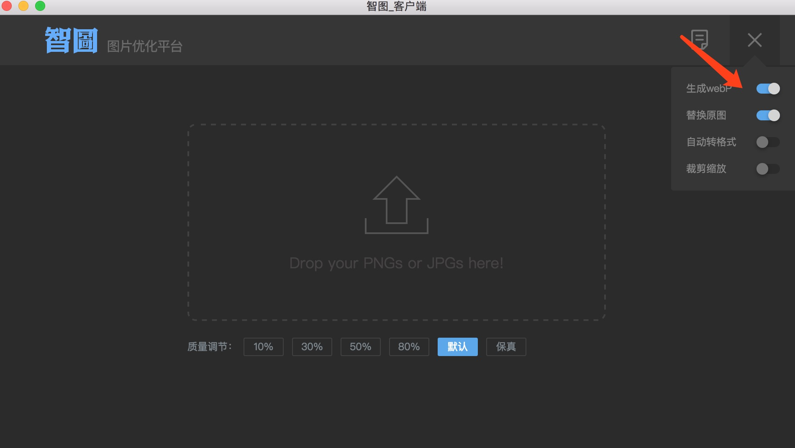
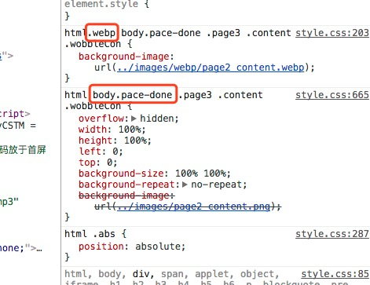

CreateJS初体验
------------------
项目一上线就迫不及待的想跟大家分享做的这个项目，算是一个新的尝试，觉得很有意思，在处理类似这种动画效果的h5的时候可以用CreateJS来解决，这里在加载优化上也做了'极致'的优化。

CreateJS是基于HTML5开发的一套模块化的库和工具。基于这些库，可以非常快捷地开发出基于HTML5的游戏、动画和交互应用。这个是官网给的官方说法，简单的说就是一个游戏框架，说到游戏框架，自然要说到[phaser](https://github.com/photonstorm/phaser)、[pixi](https://github.com/pixijs/pixi.js)、[cocos](http://www.cocos.com/?v=CN)、[egret](https://www.egret.com/)等优秀的游戏框架。

下面我将从一个前端菜鸟的角度简单去讲下这些框架。

### phaser

这个是我使用的比较多的框架，用这个做过好几个h5，可以[点击这里](https://github.com/yuwanli/phaser-collection/blob/master/README.md)查看，之所以会选择这个引擎的原因其实很简单，因为[demo](https://github.com/photonstorm/phaser-examples)比较多，可以把phaser-examples下下来然后配置一个简单的php服务器即可（我使用的是xampps），使用起来方便。这一点我觉得对于前端菜鸟来说很重要，能够很快的上手和灵活应用。



### pixi

pixi.js使用WebGL,是一个超快的HTML5 2D渲染引擎。phaser内部使用的也就是pixi。较phaser肯定是更为轻量级。我也有几个h5用的是pixi，可以[点击这里](https://github.com/yuwanli/collection-mobile-page#pixi)查看。

### cocos

游戏开发一站式解决方案。这个定义和指向就很明确，针对游戏开发，之前有试过用cocos creator（可视化开发）来开发h5的小游戏，由于时间紧迫，后来还是选择了熟悉的代码方式开发。

### egret

和cocos为同一类型的产品，但是我倒是没有用他们的产品开发h5，而是用他们的wing来开发[小程序](https://github.com/yuwanli/octopus-wxapp)了，结合小程序官方的开发工具，可以方便的进行开发。我的[章鱼活动平台 小程序](https://github.com/yuwanli/octopus-wxapp)有讲到这个。

### CreateJS

那这里就重点说下CreateJS，这个这次是第一次使用，其实之前有了解到是个游戏框架，但是觉得phaser和pixi差不多就能满足我的需求了，所以也没去尝试研究这个。但是，下面这个项目的时候，涉及到一个动画制作的问题，可以扫码体验下


大家看到这个动画的时候，思考以下如果让你来做，你会用什么方式来实现这样的动画。我当时想到的有下面两种方式，一是通过把需要动的部位做拆分，然后通过css3去动这些零部件，达到这种效果。下面这个h5里面的月亮的动作就是这么来控制的，但是存在的问题是，会乱，不太好控制。


还有就是通过帧动画来，让设计做出几帧循环播放即可。下面这个h5里面的人物的动作就是通过简单的几帧来实现的，但是只适合这种小场景的简单动画。


当时以上的这两种方式实现的动画都很简单，几个动作就可以，但是现在的动画的要求可能需要三十几帧呢，还用以上两种方式还行么？而且还有一个需求就是，要对动画的时机有判断，可以查看案例[test02](test02.html)，然后打开控制台，可以看到，当人物停下来，和收到信息都有输出，这个如果让你来写，你会怎么去写？是不是很头疼！所以这个也是动画中的一个难点，对动画的时机进行控制，去控制动画中的某一个具体的时间点。这里经验丰富的设计告诉我他能通过Adobe Animate CC 制作骨骼动画，然后输出html和js，也就是现在大家看到的两个demo，是不是觉得很酷，可以看下第二个demo的[js](oldman03.js)，可以手动在某一帧的时候进行操作。整个h5通过这种方式然后加上css中animation中的`animation-duration`和`animation-delay`来把控节奏。

```javascript
this.frame_59 = function() {
    console.log("stop")
}
this.frame_94 = function() {
    console.log("end")
}
```

那使用了creatjs以后接踵而至当然就是如何去优化这个项目了，由于时间紧迫，整个项目中有5处动画，也就是有5个js文件，没有时间去研究如何把多个动画放在同一个文件（Adobe Animate CC是一个动画输出一组文件），当然这里肯定有其他更好的方式，我这里说下我在这种情况下怎么去做的优化。js的按需加载，第一个动画因为首页就要有，所以也就直接就加载，后面的4个动画，都是在创建之前先去请求js文件(这里的4个js文件都是50k左右)，然后再去执行动画。
```javascript

//加载js
var JsLoader={
    load:function(sUrl,fCallback){
        var _script = document.createElement("script");
        _script.setAttribute("type","text/javascript");
        _script.setAttribute("src",sUrl);
        document.getElementsByTagName("head")[0].appendChild(_script);

        if(/msie/.test(window.navigator.userAgent.toLowerCase())){
            _script.onreadystatechange=function(){
                if(this.readyState=="loaded"||this.readyState=="complete"){
                    fCallback();
                }
            };
        }else if(/gecko/.test(window.navigator.userAgent.toLowerCase())){
            _script.onload=function(){
                fCallback();
            };
        }else{
            fCallback();
        }
    }
};

//生成动画
JsLoader.load("http://mat1.gtimg.com/zj/yuwanli/dzw1707/gov/js/oldman02.min.js", function(){
    creatJsStart('oldman02',new oldman02.oldman02(),oldman02);//生成动画
})

```

那现在大家看到的成品和最初的设计是有很大出入的，后期做了很大的修改，这也是让我很烦的一点，客户爸爸说要改，然后这边就屁颠屁颠给改了。其实，当项目真正做完的时候，再去回想的时候，觉得模块化没有做好，很多东西可以封装起来，易于扩展。因为有很多类似的判断，有体验过的同学应该有体会，其实这个就是一个答题的游戏，无非是答题的过程融入了动画，所以答题这个就可以抽象出来模块化。当然，最初只有三道题，感觉就拿h5的形式做就行，后来加了一道题，然后里面逻辑改了些以后，会发现扩展起来很麻烦，算是一个教训吧。如果不再复用此h5的话，其实目前的做法也能说的过去。



然后这里简单说下锁机制吧，就是防止重复点击的效果，重复点击一个按钮，这里是通过一个`key`的标识位来实现的。

```javascript
var key = true;//锁
$(document).on("tap",".page3 .wobbleCon .choose.open",function () {
    if(!key){
        return
    }
    key = false;
    $(".page3 .wobbleCon").addClass("active");
})
$(document).on("tap",".page3 .tipsCon .text",function () {
    key = true;
})
```

说到锁机制就想到了事件节流(函数防抖、防止连续触发)，具体我也不展开去讲了，也是类似的一个处理方式。

```javascript
var textarea = document.getElementById("text")
var timeoutId
textarea.addEventListener('keyup',function(){//防止连续触发change事件
    if(timeoutId){
        clearTimeout(timeoutId)
    }
    timeoutId = setTimeout(function(){
        //触发change事件
    },100)
})
```

整个项目涉及的然后还要说下图片上的优化，一般的h5不太会去用这种方式，就是所谓的webp，这个格式的图片很小，算是能做出很大的优化。实现的方式也很简单，就是在`head`里的引入css文件之前，插入以下这段js代码，要是设备支持的话就会给html添加一个webp的class，h5中的图片尽量都用背景图的形式，只需要在`html`有无webp这个class下做一个切换即可，我这里配合这less使用的。

```javascript
//注意该断js要放在比较靠前的地方，最好是所有加载资源的前面
//js是单线程的，这样可实现的效果就是页面一打开就先去判断该宿主浏览器webp的兼容性
(function() {
function webpTest(src, name) {
    var img = new Image(),
        isSupport = false,
        className, cls;

    img.onload = function() {
        isSupport = !!(img.height > 0 && img.width > 0);

        cls = isSupport ? (' ' + name) : (' no-' + name);
        className = document.querySelector('html').className
        className += cls;

        document.querySelector('html').className = className.trim();
    };
    img.onerror = function() {
        cls = (' no-' + name);
        className = document.querySelector('html').className
        className += cls;

        document.querySelector('html').className = className.trim();
    };

    img.src = src;
}

var webpSrc = 'data:image/webp;base64,UklGRiQAAABXRUJQVlA4IBgAAAAwAQCdASoB\
    AAEAAwA0JaQAA3AA/vuUAAA=',
    webpanimationSrc = 'data:image/webp;base64,UklGRlIAAABXRUJQVlA4WAoAAAA\
                SAAAAAAAAAAAAQU5JTQYAAAD/////AABBTk1GJgAAAAAAAAAAAA\
                AAAAAAAGQAAABWUDhMDQAAAC8AAAAQBxAREYiI/gcA';

webpTest(webpSrc, 'webp');
webpTest(webpanimationSrc, 'webpanimation');
})();
```

可以查看项目的`html`文件，会发现基本上没有img标签，因为这里这种通过less来控制一个固定容易背景图片使用什么格式的图片。大家可以想一下，如果用img的方式，用`data-src`的方式的话，无非是js去给`src`赋值，这样会导致频繁修改`img`这个dom的`src`属性，一个基本常识，操作dom会很消耗性能。


```less
html{
  @baseUrl:'../images/';
  @imgNameJpg:.jpg;
  @imgNamePng:.png;
  &.webp{
    @baseUrl:'../images/webp/';
    @imgNameJpg:.webp;
    @imgNamePng:.webp;
    .cover{
      background-image: url("@{baseUrl}cover@{imgNameJpg}");
    }
  }
  .cover{
      .full;
      .coverImg;
      z-index:10;
      opacity: 0.8;
      background-image: url("@{baseUrl}cover@{imgNameJpg}");
  }
}
```

还有一个常用的js插件，[pace.js](http://github.hubspot.com/pace/docs/welcome/)，简单的说下，这个就是实现页面进度条的一个插件。它会在资源加载到100%的时候给`body`加上`pace-done`的class，然后也是通过这个class，后面几个page在没有这个class的时候是没有`background-image`的，有这个class的时候，才会去加载相应的class。实现的效果就是，页面打开的时候只加载的第一页的相关素材，完全打开以后才去加载后面的图片。



* 对应上面可以看到
    * 当前容器的背景图只会在`pace-done`的时候才会加载，意味着在页面读进度条的时候不会加载该图片
    * 上面`webp`，在检测到该宿主浏览器支持`webp`的时候，且已经`pace-done`的时候会去加载`webp`资源

这里建议用less或者sass等来编写css，这样的话，在做上面的这些优化就很快。

 这个有一个东西要说一下-`viewport`，h5的话大家的第一反应应该是要加上`<meta name="viewport" content="width=device-width, initial-scale=1,user-scalable=no,minimum-scale=1, maximum-scale=1">`，当时查看源码的看，会发现我没有加，因为加了以后图片会变得模糊，这也是一直很困惑我的一个地方，我所有的游戏类的h5都没加这个meta。不知道大家有没有碰到过这种问题，或者更好的解决方案，可以留言给我。


